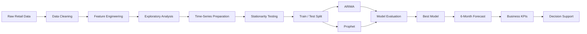

# 📈 Enterprise Sales Forecasting

<p align="center">

**Turning historical sales data into actionable business forecasts.**

</p>

<p align="center">
  
  
  
  
  

</p>

<p align="center">
  <a href="#-overview">Overview</a> •
  <a href="#-pipeline">Pipeline</a> •
  <a href="#-models">Models</a> •
  <a href="#-results">Results</a> •
  <a href="#-insights">Insights</a> •
  <a href="#-future-roadmap">Roadmap</a>
</p>

---

## 🎯 Overview

**Enterprise Sales Forecasting** is an end-to-end **time-series analytics project** that analyzes historical retail sales and predicts future demand using statistical forecasting techniques.

The project answers a practical business question:

> **“Based on historical sales behavior, what can we expect sales to look like in the coming months?”**

The pipeline combines:

**Data Engineering → EDA → Statistical Analysis → Forecasting → Model Evaluation → Business Insights**

The final system compares **ARIMA** and **Prophet**, evaluates their forecasting accuracy, selects the stronger approach, and produces a **6-month sales forecast with confidence intervals**.

---


## 📊 Executive Dashboard

<p align="center">
  
</p>

> An executive-level view of historical sales, forecasting performance,
> regional performance, category performance, and key business KPIs.


## 💡 Why This Project?

Sales forecasting directly impacts:

| Business Area | Forecasting Benefit          |
| ------------- | ---------------------------- |
| 📦 Inventory  | Reduce overstock & stockouts |
| 💰 Revenue    | Improve financial planning   |
| 🏪 Stores     | Identify performance trends  |
| 🎯 Promotions | Support campaign planning    |
| 📊 Management | Improve KPI-based decisions  |

This project demonstrates how machine-learning/statistical techniques can be translated into **business decision support** rather than stopping at model training.

---

## 📊 Project Snapshot

<p align="center">

|      Dataset     |    Coverage   |        Models       |   Forecast   |
| :--------------: | :-----------: | :-----------------: | :----------: |
| **73K+** records | **2022–2024** | **ARIMA + Prophet** | **6 Months** |

</p>

### Dataset Dimensions

```text
73,100 Records
15 Original Features
5 Stores
20 Products
4 Regions
5 Categories
2022 → 2024
```

---

# 🔄 Forecasting Pipeline



---

# 🧠 What the Project Does

### 01 — Data Engineering

The raw retail dataset is transformed into an analysis-ready time series.

**Operations include:**

* Date parsing
* Data validation
* Chronological sorting
* Missing-value analysis
* Monthly aggregation
* Sales calculation
* Profit calculation

### 02 — Business Metrics

The pipeline derives important business metrics:

```text
Sales = Units Sold × Price

Profit = Sales × (1 − Discount / 100)
```

These metrics provide the foundation for the business analysis.

### 03 — Exploratory Data Analysis

The project investigates:

* 📈 Sales trends
* 💵 Profit trends
* 🌎 Regional performance
* 🏪 Store performance
* 📦 Product categories
* 📅 Monthly patterns
* 🔁 Year-over-year changes


<p align="center">
  
</p>


### 04 — Statistical Analysis

The time series is evaluated using the **Augmented Dickey-Fuller (ADF) test** to assess stationarity before forecasting.

An **80/20 chronological train-test split** is used to preserve temporal ordering.

---

# 🤖 Forecasting Models

## ARIMA

**AutoRegressive Integrated Moving Average**

ARIMA models temporal dependencies through:

* Autoregression
* Differencing
* Moving averages

It serves as the primary statistical forecasting baseline.

---

## Prophet

**Prophet** models:

* Trend
* Seasonality
* Changepoints
* Prediction intervals

Prophet provides an alternative forecasting approach designed around business time-series patterns.

---

# 🏆 Model Performance

The models were evaluated on the held-out test period.

| Model        |        RMSE |        MAE |        MAPE |
| ------------ | ----------: | ---------: | ----------: |
| 🥇 **ARIMA** | **$10.03M** | **$4.80M** | **652.72%** |
| Prophet      |    $113.47M |    $98.17M |    5659.75% |

<p align="center">
  
</p>

### 🥇 Current Winner: ARIMA

ARIMA substantially outperformed Prophet on the current test split across **RMSE, MAE, and MAPE**.

> ⚠️ The unusually high MAPE indicates that percentage error is unstable for portions of this dataset where actual sales values are very small or zero. RMSE and MAE provide more reliable context for interpreting this experiment.

---

# 🔮 Forecasting Output

The selected forecasting pipeline produces a **6-month sales forecast** with 95% confidence intervals.

```text
┌─────────────────────────────────────────┐
│           FUTURE SALES FORECAST          │
├─────────────────────────────────────────┤
│ Forecasted Sales                        │
│ Lower 95% Confidence Interval           │
│ Upper 95% Confidence Interval           │
│ Selected Forecasting Model               │
└─────────────────────────────────────────┘
```

Output:

```text
Forecast_Results.csv
```

---

# 📈 Business Analytics

The project goes beyond forecasting by connecting predictions with business KPIs.

### Key Metrics

* Total Sales
* Total Profit
* Profit Margin
* Units Sold
* Average Monthly Sales
* Forecasted Sales
* Regional Sales
* Store Performance
* Category Performance

This makes the project relevant to **Data Analyst, Business Analyst, Data Scientist, and BI-oriented roles**.

---

# 🔍 Key Takeaways

### 📌 Model Selection

ARIMA demonstrated significantly stronger performance than Prophet on the current test period.

### 📌 Metric Selection Matters

MAPE can become misleading when actual values approach zero. This highlights an important practical forecasting lesson:

> **Model evaluation must consider the characteristics of the business data, not just the model's headline accuracy metric.**

### 📌 Forecasting ≠ Decision Making

A useful enterprise forecasting system should connect:

**Prediction → KPI → Interpretation → Business Action**

rather than simply generating a future number.

---

# 🛠️ Tech Stack

| Technology      | Purpose                   |
| --------------- | ------------------------- |
| 🐍 Python       | Core programming          |
| 🐼 Pandas       | Data manipulation         |
| 🔢 NumPy        | Numerical computation     |
| 📊 Matplotlib   | Visualization             |
| 🎨 Seaborn      | Statistical visualization |
| 📈 Statsmodels  | Statistical modeling      |
| 🤖 pmdarima     | ARIMA optimization        |
| 🔮 Prophet      | Time-series forecasting   |
| 📏 Scikit-learn | Model evaluation          |
| 📓 Jupyter      | Development environment   |

---

# 📁 Repository Structure

```text
Enterprise-Sales-Forecasting/
│
├── 📓 Sales_Forecasting_Pipeline.ipynb
│
├── 📊 retail_store_inventory.csv
│
├── 📈 Forecast_Results.csv
│
├── 📋 Model_Comparison.csv
│
└── 📄 README.md
```

---

# ⚡ Quick Start

### Clone

```bash
git clone https://github.com/JiveshNage/Enterprise-Sales-Forecasting.git
cd Enterprise-Sales-Forecasting
```

### Create Environment

```bash
python -m venv .venv
```

### Activate — Windows

```bash
.venv\Scripts\activate
```

### Install Dependencies

```bash
pip install pandas numpy matplotlib seaborn statsmodels pmdarima prophet scikit-learn
```

### Launch

```bash
jupyter notebook
```

Open:

```text
Sales_Forecasting_Pipeline.ipynb
```

---

# 🚀 Future Roadmap

The current project is an analytical prototype. The next version could evolve into a production-grade forecasting platform.

### 🔮 Forecasting

* [ ] SARIMA / SARIMAX
* [ ] XGBoost forecasting
* [ ] LightGBM
* [ ] Ensemble forecasting
* [ ] Rolling-window cross-validation
* [ ] Hyperparameter optimization

### 🧩 Feature Engineering

* [ ] Price elasticity
* [ ] Promotion effects
* [ ] Competitor pricing
* [ ] Weather effects
* [ ] Holiday effects
* [ ] Inventory constraints

### 📊 Business Intelligence

* [ ] Power BI dashboard
* [ ] Interactive KPI monitoring
* [ ] Store-level forecasting
* [ ] Category-level forecasting
* [ ] Automated executive reporting

### ☁️ Production

```text
Forecasting Engine
       ↓
     FastAPI
       ↓
   PostgreSQL
       ↓
 Power BI / Streamlit
       ↓
Executive Dashboard
```

---

# 💼 Resume Value

This project demonstrates practical experience in:

**Python • Data Analytics • Time-Series Forecasting • Statistical Modeling • EDA • Feature Engineering • Model Evaluation • Business KPIs • Data Visualization • Decision Support**

### Suggested Resume Entry

> **Enterprise Sales Forecasting | Python, ARIMA, Prophet, Pandas, Statsmodels**
> Developed an end-to-end retail sales forecasting pipeline using ARIMA and Prophet, performing EDA, stationarity testing, chronological validation, KPI analysis, model comparison, and six-month forecasting with confidence intervals.

---

# 👨‍💻 Author

### Jivesh Nage

**Computer Science & Engineering | Data Analytics | Machine Learning | AI**

⭐ If you found this project useful, consider starring the repository.

<p align="center">

**Built with Python • Statistics • Forecasting • Business Analytics**

</p>
